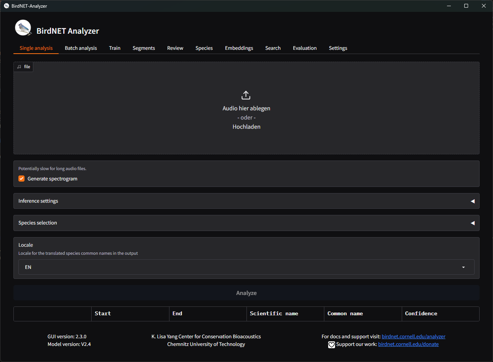

# Summary

BirdNET-Analyzer is an open-source toolkit for detection and classification of bird vocalizations in audio recordings using the well established *BirdNET* model [@kahl2021birdnet]. The software provides both a graphical user interface (GUI) and a command-line interface (CLI), making it accessible to users with varying levels of technical expertise.

The package supports macOS and Windows through dedicated installers, and it is also distributed as a Python package via PyPI to allow integration into custom pipelines and larger-scale ecological monitoring workflows. The BirdNET-Analyzer simplifies the use of state-of-the-art machine learning techniques for biodiversity research.

# Statement of need

Monitoring avian biodiversity is a crucial component of ecological research, conservation planning, and the assessment of environmental change. Birds are highly sensitive to changing ecological factors, making them valuable indicators of the ecosystem health and the success of restoration efforts.

Passive acoustic monitoring (PAM) has rapidly gained prominence in ecological research as a long-term and non-invasive approach to studying biodiversity. A systematic review of terrestrial PAM studies highlights a fifteenfold increase in publications since the 1990s, underscoring its growing importance and the ongoing need for standardized and automated analysis tools [@sugai2019terrestrial].

Manual listening and annotation are time-consuming, can be subjective, and impractical for the growing volume of acoustic data collected by autonomous recording units and community projects, such as BirdNET-Pi [@birdnetpi]. As a result, there is a growing need for reliable, scalable, and user-friendly software to automate bird sound identification.

A persistent challenge in the field lies in the divide between machine learning developers and ecologists: while researchers continue to advance neural network–based sound classifiers, many ecologists face high technical barriers to adopting these tools. BirdNET-Analyzer bridges this gap by offering an intuitive GUI that supports common ecological workflows without requiring programming knowledge, while also providing a powerful CLI for advanced users and automated processing.

By combining accessibility with flexibility, BirdNET-Analyzer empowers researchers, conservationists, and citizen scientists to efficiently analyze large acoustic datasets, derive meaningful biodiversity insights, and integrate bioacoustic methods into their regular field and analytical workflows.

# Software description

The BirdNET-Analyzer is implemented in Python and built around the BirdNET deep learning model, which processes spectrogram representations of audio signals to predict the presence of bird species along with associated confidence scores and timestamps. The tool supports multiple output formats to facilitate interoperability with widely used software in ecology, including Raven Pro [@ravenpro], Audacity, Kaleidoscope, and CSV formats.

The generated outputs can also be easily integrated with complementary tools, such as birdnetR [@birdnetR], an R package that provides a convenient interface for querying BirdNET results, visualizing detections, and linking acoustic predictions to environmental or spatial datasets. Together, these tools form an open ecosystem that for creating bioacoustic workflows across programming environments.

The software can be considered as a modular collection of tools, that represent the core workflow of ecological audio analysis.

**Single analysis** can be used to quickly identify the species in a single audio file for rapid assessment or validation.

**Batch analysis** will recursivly process all files in a root directory and save the result files to the specified output.

**Train** allows users to built upon the BirdNET model by training their own classifier on custom data, to adapt to specific regions, taxa or even non-avian sounds.

**Segments** extracts audio snippets based on the resulting timestamps for a more focused review or subsequent analysis.

**Review** enables users to quickly audit and verify extracted segments or arbitrary audio files to determine model accuracy and the reliability of detections.

**Embeddings** computes and stores the acoustic embeddings, which is a compressed representation of the audio signal, on disk or in the perch-hoplite (cite?) database to be indexed and searched later.

**Search** allows users to query an embedding database for similar audio samples, supporting tasks such as call-type comparison or acoustic clustering.

**Evaluation** gives the user widely used performance metrics to compare the model predictions against the annotated data.

# Beyond Birds

Users can create custom classifiers in the **Train** tab, retraining only the classification layer of the model. This approach has been successfully applied to region-specific endangered species [@weidlich2025continuous] as well as other taxa, including amphibians [@perez2023combining], mammals, and insects, demonstrating the framework’s adaptability for general-purpose bioacoustic monitoring and ecological sound classification.

# Community

The project is actively developed and maintained by the BirdNET research team, with a growing user community. BirdNET and the BirdNET-Analyzer are used in a number of ongoing research projects [TODO citations]

# Funding

BirdNET is a joint effort of partners from academia and industry. TODO

# References
